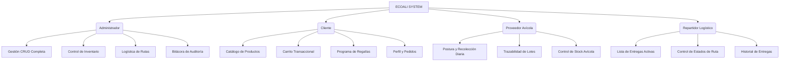

# 🌿 EcoAli - Plataforma de Trazabilidad Orgánica y Gestión de Lotes

EcoAli es una plataforma web premium de comercio justo, trazabilidad y gestión logística para productos orgánicos y avícolas. El sistema conecta directamente a productores avícolas (proveedores), clientes finales y repartidores logísticos bajo la supervisión de un centro de control administrativo integral.

El software destaca por su alto estándar visual, su diseño limpio y minimalista, y un sistema responsivo híbrido adaptado a las necesidades de cada usuario según su dispositivo.

---

## 🛠️ Arquitectura y Stack Tecnológico

El proyecto está diseñado bajo un enfoque modular y orientado a eventos empleando tecnologías nativas estables para maximizar la velocidad y compatibilidad:

*   **Backend**: PHP 8.x con arquitectura procedimental limpia e interactiva.
*   **Base de Datos**: MySQL / MariaDB con llaves foráneas, transacciones seguras e índices optimizados.
*   **Frontend**: HTML5 Semántico, CSS3 Premium con variables globales (`:root`), transiciones dinámicas y micro-animaciones, junto a Vanilla JavaScript para la manipulación asíncrona del DOM.
*   **Comunicación asíncrona**: Peticiones AJAX mediante la API `fetch` para operaciones sin recarga de pantalla (enviar producción, actualizar perfiles, cambiar estados logísticos).
*   **Seguridad**: Encriptación hash bcrypt para contraseñas, validación de sesiones activas, protección contra inyecciones SQL usando consultas preparadas (Prepared Statements) e integración con Google Sign-In (OAuth 2.0).

---

## 📂 Estructura del Proyecto

El código está estructurado de manera organizada, separando la lógica de backend de la visualización y los recursos del sistema:

```bash
ecoali_proyecto/
├── assets/                    # Recursos estáticos del frontend
│   ├── css/                   # Hojas de estilo unificadas
│   │   ├── globals.css        # Sistema de diseño global (tipografía, colores, responsive, etc.)
│   │   ├── inventario_admin.css
│   │   ├── proveedor.css
│   │   └── repartidor.css
│   └── js/                    # Scripts dinámicos
│       └── admin_menu.js      # Lógica del menú hamburguesa del administrador
├── forms/                     # Controladores y lógica de peticiones backend (AJAX y Forms)
│   ├── conexion.php           # Configuración del puente a base de datos (PDO/MySQLi)
│   ├── config_mail.php        # Configuración de servidor de correos SMTP
│   ├── procesar_login.php     # Validación y creación de sesiones
│   ├── procesar_pedido.php    # Creación y guardado transaccional de órdenes de compra
│   ├── procesar_produccion.php# Registro de recolección diaria de lotes (proveedores)
│   ├── *perfil.php            # Controladores de actualización de datos de usuario
│   └── *_acciones.php         # Controladores CRUD (Usuarios, Productos, Clientes, Inventario)
├── dashboard_admin.php        # Tablero de control general del administrador
├── dashboard_cliente.php      # Panel del cliente (Catálogo y pedidos)
├── dashboard_proveedor.php    # Panel del proveedor avícola (Producción y lotes)
├── dashboard_repartidor.php   # Panel del repartidor (Entrega y rutas logísticas)
├── bitacora_admin.php         # Módulo administrativo para auditoría del sistema
├── login.php                  # Pantalla de acceso y autenticación corporativa
├── register.php               # Formulario de autoregistro de clientes
└── README.md                  # Documentación oficial del proyecto
```

---

## 👥 Módulos de Usuario y Paneles de Control

El sistema cuenta con cuatro perfiles de usuario perfectamente definidos, cada uno con una interfaz diseñada específicamente para su flujo de trabajo:



### 1. Módulo del Administrador (`dashboard_admin.php`)
Es el núcleo administrativo del sistema. Permite supervisar y modificar el estado global del negocio.
*   **Gestión de Cuentas (`usuarios_admin.php`, `clientes_admin.php`, `proveedores_admin.php`)**: Control total de usuarios, roles y activaciones de cuentas de todos los actores.
*   **Control de Inventario y Productos (`productos_admin.php`, `inventario_admin.php`)**: Catálogo maestro de productos orgánicos y asignación de lotes en stock.
*   **Logística y Despachos (`logistica_admin.php`)**: Asignación de pedidos a repartidores específicos y monitoreo en tiempo real.
*   **Auditoría y Bitácora (`bitacora_admin.php`)**: Historial inmutable que registra cada acción relevante en el sistema (quién modificó un perfil, cuándo se autorizó un despacho, inicios de sesión, etc.).
*   **Navegación**: Utiliza un panel lateral fijo en computadoras y un **menú deslizante tipo hamburguesa** con overlay translúcido de protección en tabletas y móviles.

### 2. Módulo del Cliente (`dashboard_cliente.php`)
Diseñado para ofrecer una experiencia de compra fluida, rápida y sumamente visual.
*   **Catálogo Interactivo**: Tarjetas de productos orgánicos con detalles de frescura, stock y precios.
*   **Carrito de Compras Transaccional**: Procesamiento seguro de pedidos directamente en base de datos.
*   **Programa de Regalías**: Sistema de fidelización que premia las compras recurrentes del cliente con puntos canjeables por productos orgánicos gratuitos.
*   **Navegación**: En dispositivos móviles y tabletas cuenta con una **barra de navegación inferior compacta** de 50px de alto, eliminando estorbos visuales superiores.

### 3. Módulo del Proveedor Avícola (`dashboard_proveedor.php`)
Optimizado para el trabajo en granja y almacén avícola.
*   **Registrar Postura Diaria**: Formulario dinámico para ingresar la recolección del día (huevos, tipo, cantidad, estado).
*   **Control de Lotes y Trazabilidad**: Visualización de los lotes activos en almacén listos para recolección logística.
*   **Navegación**: Totalmente libre de barras de hamburguesa en móvil/tableta; utiliza el **menú de navegación inferior compacto** de 50px de altura para un acceso sumamente ágil con una sola mano.

### 4. Módulo del Repartidor Logístico (`dashboard_repartidor.php`)
Diseñado para la eficiencia en ruta y entregas de última milla.
*   **Lista de Paradas Activas**: Resumen claro de los pedidos pendientes de entrega con dirección del cliente, teléfono y total.
*   **Estados Logísticos Dinámicos**: Permite actualizar el estado del pedido en tiempo real (En Camino ➔ Entregado ➔ Cancelado).
*   **Historial de Ruta**: Registro de los despachos completados exitosamente.
*   **Navegación**: Optimizado con el **menú inferior ultra-compacto** de 50px de altura y sin botones superiores distractores.

---

## 📱 Diseño de Navegación Premium y Responsivo

El sistema utiliza un paradigma híbrido de visualización enfocado en la usabilidad según el dispositivo (Desktop vs. Tableta/Móvil):

### Computadoras de Escritorio (Desktop: > 991px)
Todos los paneles despliegan una **barra lateral izquierda de navegación fija** con tipografía premium y bordes curvos de cristal templado, garantizando que todas las secciones estén a un solo clic de distancia.

### Teléfonos Móviles y Tabletas (Responsivo: <= 991px)
Para los paneles de **Cliente, Proveedor y Repartidor**, se prioriza la visualización táctil:
*   **Ocultamiento de Barra Lateral**: Se esconde automáticamente al 100% para liberar el ancho total de la pantalla.
*   **Barra de Navegación Inferior Ultra-Compacta (`.mobile-nav`)**:
    *   **Altura**: `50px`
    *   **Tamaño de Iconos**: `15px`
    *   **Tamaño de Texto**: `12px` con peso extra-negrita (`800`)
    *   **Micro-Animaciones**: Al tocar una pestaña, el icono activo realiza un sutil zoom táctil del `12%` (`transform: scale(1.12)`).
    *   **Fondo**: Cristal blanco esmerilado (`backdrop-filter: blur(12px)`) con sombreado sutil que flota elegantemente en la base.

Para el panel de **Administrador**:
*   Se despliega un **botón flotante de hamburguesa** en la esquina superior izquierda.
*   Al presionarlo, emerge de manera fluida un cajón lateral deslizante (`.aside`) con un overlay oscuro cálido en el fondo (`.admin-menu-overlay`) que bloquea las interacciones traseras y redirige el foco al menú de administración.

---

## 💾 Esquema de Base de Datos y Trazabilidad

El sistema opera sobre una base de datos relacional con las siguientes tablas clave:

1.  **`usuarios`**: Almacena las credenciales de acceso, estado activo/inactivo, rol (`rol_id`), código de verificación y tokens de inicio de sesión.
2.  **`usuario_perfil`**: Información detallada de contacto ligada al usuario (Nombre, Apellido, Email, Teléfono, Dirección).
3.  **`lotes`**: Control de stock avícola. Vincula la producción registrada por un proveedor con un código único de trazabilidad orgánica.
4.  **`pedidos`**: Encabezado de órdenes de compra con repartidor asignado, estado logístico, dirección y total.
5.  **`regalias`**: Historial de puntos y recompensas acumulados por cliente.
6.  **`bitacora`**: El libro de auditoría del administrador. Guarda el registro de operaciones, IP, usuario y descripción de la acción.

---

## 🚀 Guía de Instalación y Configuración Local

Para ejecutar el proyecto EcoAli en un entorno de desarrollo local:

### 1. Requisitos Previos
*   Instalar **XAMPP** (con PHP 8.0 o superior y MySQL).
*   Un editor de código (VS Code recomendado).

### 2. Configuración de Directorios
1.  Clona o copia la carpeta del proyecto dentro del directorio de publicación web de XAMPP:
    ```bash
    C:\xampp\htdocs\ecoali_proyecto\
    ```
2.  Inicia los módulos **Apache** y **MySQL** desde el Panel de Control de XAMPP.

### 3. Configuración de la Base de Datos
1.  Ingresa a tu navegador a `http://localhost/phpmyadmin/`.
2.  Crea una nueva base de datos llamada `ecoali` (o el nombre configurado en tu conexión).
3.  Importa el archivo SQL del proyecto (normalmente ubicado en la carpeta del instalador o raíz).
4.  Verifica los datos de conexión en el archivo:
    `[forms/conexion.php](file:///d:/xampp/htdocs/ecoali_proyecto/forms/conexion.php)`
    ```php
    $host = "localhost";
    $user = "root";
    $password = "";
    $dbname = "ecoali"; // Verifica que coincida con tu base de datos
    ```

### 4. Ejecución del Sistema
Ingresa al navegador y accede a la URL local del proyecto:
`http://localhost/ecoali_proyecto/`
