# 🌿 EcoAli - Plataforma de Trazabilidad Orgánica y Gestión de Lotes

EcoAli es una plataforma web premium de comercio justo, trazabilidad y gestión logística para productos orgánicos y avícolas. El sistema conecta directamente a productores avícolas (proveedores/granjeros), clientes finales y repartidores logísticos bajo la supervisión de un centro de control administrativo integral.

El software destaca por su alto estándar visual, su diseño limpio y minimalista, y un sistema responsivo híbrido adaptado a las necesidades de cada usuario según su dispositivo.

---

## 🛠️ Arquitectura y Stack Tecnológico

El proyecto está diseñado bajo un enfoque modular y orientado a eventos empleando tecnologías estables para maximizar la velocidad y compatibilidad:

*   **Backend**: PHP 8.x con arquitectura procedimental limpia, estructurada y modular.
*   **Base de Datos**: MySQL / MariaDB con llaves foráneas, restricciones de integridad referencial (`ON DELETE CASCADE`), transacciones seguras e índices optimizados.
*   **Frontend**: HTML5 Semántico, CSS3 Premium con variables globales (`:root`), transiciones dinámicas y micro-animaciones, junto a Vanilla JavaScript para la manipulación asíncrona del DOM.
*   **Servicios Externos**: 
    *   **Bing Maps API**: Integración avanzada con mapas interactivos de Microsoft, empleando estilos premium oscuros (`canvasDark`) y supresión dinámica en tiempo real de banners de error de credenciales.
    *   **Web Speech API**: Asistente virtual accesible ("Doña Ali") con síntesis de voz femenina personalizada y reconocimiento de voz (dictado por micrófono) para interacciones ágiles.
*   **Seguridad**: Encriptación hash bcrypt para contraseñas, validación de sesiones activas por roles, protección contra inyecciones SQL usando consultas preparadas (Prepared Statements) e integración con Google Sign-In (OAuth 2.0).

---

## 📂 Estructura del Proyecto

El código está organizado separando la lógica del backend (controladores AJAX y procesamiento de formularios) de los recursos visuales del frontend:

```bash
ecoali_proyecto/
├── assets/                    # Recursos estáticos del frontend
│   ├── css/                   # Hojas de estilo unificadas
│   │   ├── globals.css        # Sistema de diseño global (variables de color, tipografía, reset)
│   │   ├── admin.css          # Estilos del panel administrativo general
│   │   ├── cliente.css        # Estilos del catálogo e interfaces del cliente
│   │   ├── proveedor.css      # Estilos del panel de control de granjeros
│   │   ├── repartidor.css     # Estilos de la hoja de ruta y mapas de repartidores
│   │   ├── inventario_admin.css
│   │   ├── proveedores_admin.css
│   │   └── style.css          # Estilos complementarios y de login/registro
│   └── js/                    # Scripts dinámicos
│       └── admin_menu.js      # Control de navegación móvil del administrador
├── forms/                     # Controladores y lógica de backend (Peticiones AJAX y Procesamiento)
│   ├── conexion.php           # Conector maestro MySQLi, migraciones de tablas y caducidad automática de lotes
│   ├── config_mail.php        # Configuración del servidor de correos SMTP para notificaciones
│   ├── procesar_login.php     # Validación de credenciales y creación de sesiones de usuario
│   ├── procesar_pedido.php    # Procesamiento transaccional de compras (FIFO, cupones, IVA, regalías)
│   ├── procesar_produccion.php# Registro de postura y generación de lotes avícolas
│   ├── cancelar_pedido.php    # Cancelación segura de compras con retorno automático de stock (FIFO Restore)
│   ├── reportar_incidencia.php# Registro de incidencias en ruta con geolocalización GPS
│   ├── actualizar_estado_entrega.php # Cierre de entregas (captura de firma Canvas, foto Base64 y GPS)
│   ├── google_login.php       # Autenticación con cuenta de Google (OAuth 2.0)
│   ├── exportar_reporte.php   # Exportador de reportes de producción a formato CSV
│   ├── *_acciones.php         # Controladores CRUD (Usuarios, Clientes, Proveedores, Inventario, Regalías)
│   └── perfil_*.php           # Controladores de actualización de perfil para cada rol
├── dashboard_admin.php        # Panel de control maestro del administrador
├── dashboard_cliente.php      # Portal interactivo del cliente (tienda, carrito, recompensas, Doña Ali)
├── dashboard_proveedor.php    # Portal del granjero (producción, control de granjas, envíos a CEDIS)
├── dashboard_repartidor.php   # Interfaz del conductor (hoja de ruta, mapas Bing, Canvas, geolocalización)
├── usuarios_admin.php         # Módulo administrativo para gestión de cuentas de usuario
├── clientes_admin.php         # Módulo administrativo para supervisión de clientes
├── proveedores_admin.php      # Módulo administrativo para supervisión de proveedores
├── inventario_admin.php       # Módulo administrativo para stock global y lotes
├── logistica_admin.php        # Módulo de despacho, asignación de rutas y pedidos atrasados
├── bitacora_admin.php         # Registro inmutable de auditoría y logs del sistema
├── editar_perfil.php          # Pantalla unificada de perfil y datos de contacto
├── login.php                  # Pantalla de acceso corporativa y Google Login
├── register.php               # Formulario de auto-registro de clientes
├── verificar_codigo.php       # Verificación en dos pasos (2FA) para registros seguros
├── comprobante.php            # Generador visual de comprobantes de entrega/pedido
└── README.md                  # Documentación técnica oficial del proyecto
```

---

## 👥 Módulos de Usuario y Paneles de Control

El sistema cuenta con cuatro perfiles de usuario perfectamente definidos, cada uno con una interfaz diseñada específicamente para su flujo de trabajo:

```mermaid
graph TD
    A["ECOALI SYSTEM"] --> B["Administrador"]
    A --> C["Cliente"]
    A --> D["Proveedor / Granjero"]
    A --> E["Repartidor Logístico"]

    B --> B1["Gestión CRUD Completa & Paginación 5x5"]
    B --> B2["Control de Inventario FIFO y Lotes"]
    B --> B3["Asignación Logística con Bloqueo de Costos"]
    B --> B4["Bitácora de Auditoría Inmutable"]

    C --> C1["Catálogo con Búsqueda en Tiempo Real"]
    C --> C2["Checkout con Doble Bloqueo e Input Sanitizers"]
    C --> C3["Asistente de Voz Doña Ali"]
    C --> C4["Notificaciones Swipe-to-Delete"]

    D --> D1["Postura Diaria & Trazabilidad de Lotes"]
    D --> D2["Registro de Granjas & Envíos a CEDIS"]
    D --> D3["Asistente de Voz Doña Ali"]

    E --> E1["Hoja de Ruta con Bing Maps canvasDark"]
    E --> E2["Firma Canvas & Fotos Base64 en Entregas"]
    E --> E3["Reporte de Incidencias & Retorno de Stock"]
```



### 1. Módulo del Administrador (`dashboard_admin.php`)
Es el centro de control del negocio. Permite supervisar y modificar el estado del sistema.
*   **Gestión de Cuentas (`usuarios_admin.php`, `clientes_admin.php`, `proveedores_admin.php`)**: Control total de usuarios, roles y activaciones. Las tablas incluyen paginación dinámica interactiva de 5 en 5 registros.
*   **Control de Inventario y Productos (`productos_admin.php`, `inventario_admin.php`)**: Catálogo maestro de productos y asignación de lotes en stock global.
*   **Logística y Despachos (`logistica_admin.php`)**: Permite asignar pedidos a conductores específicos. Bloquea de forma estricta los inputs de costos para que sean de solo lectura (`readonly`). Destaca de forma visual (en rojo) los pedidos atrasados ordenándolos al inicio.
*   **Auditoría y Bitácora (`bitacora_admin.php`)**: Módulo que registra de forma inmutable cada acción relevante en el sistema (IP, usuario, módulo afectado, acción detallada y fecha/hora) con paginación optimizada.

### 2. Módulo del Cliente (`dashboard_cliente.php`)
Portal transaccional diseñado para ofrecer una experiencia de compra fluida, rápida y sumamente visual.
*   **Catálogo Interactivo**: Búsqueda y filtrado de productos en tiempo real sin recargar la página.
*   **Checkout con Doble Bloqueo**: Previene la duplicación accidental de pedidos mediante un bloqueo global de procesamiento de pagos (`isProcessingCheckout`) y sanitización en tiempo real de campos de tarjetas con expresiones regulares.
*   **Direcciones de Envío Estructuradas**: Adaptado para México con un desglose completo de dirección (Calle, Número, Colonia, Código Postal, Ciudad, Localidad) y selector dinámico de los 32 estados de la República.
*   **Asistente Virtual Doña Ali**: Burbuja flotante interactiva que ayuda al cliente a comprar, entender regalías o programar envíos mediante comandos de voz y lectura de respuestas.
*   **Gestión de Notificaciones**: Bandeja deslizante con soporte para eliminación individual interactiva mediante micro-animación de deslizamiento a la izquierda (swipe-left) y borrado total dinámico.
*   **Cancelación de Pedidos**: Los clientes pueden cancelar sus pedidos pendientes de forma segura. El stock se reincorpora al inventario automáticamente.

### 3. Módulo del Proveedor Avícola (`dashboard_proveedor.php`)
Diseñado para la gestión ágil del inventario avícola en el campo.
*   **Postura Diaria (`produccion_proveedor.php`)**: Formulario interactivo para registrar la recolección del día (huevos, tipo, cantidad, estado y código de lote autogenerado).
*   **Control de Granjas (`granjas_acciones.php`)**: Registro y administración de diferentes granjas asociadas al proveedor.
*   **Envíos a CEDIS (`entregas_proveedor.php`)**: Creación de solicitudes de envío de lotes al Centro de Distribución (CEDIS) para la cadena logística.
*   **Asistente Virtual Doña Ali**: Implementado también en esta interfaz para facilitar el uso a granjeros de la tercera edad o con problemas de visibilidad.

### 4. Módulo del Repartidor Logístico (`dashboard_repartidor.php`)
Optimizado para dispositivos móviles en ruta de última milla.
*   **Hoja de Ruta Interactiva**: Despliega un listado de entregas con direcciones del cliente, desglose detallado de cantidades e integraciones con Bing Maps en tono oscuro para trazar la ruta de reparto.
*   **Firma Manuscrita HTML5 Canvas**: Captura la firma digital del receptor en tiempo real dentro del modal de despacho.
*   **Evidencia Fotográfica**: Carga y previsualización obligatoria en Base64 de la fotografía física de la entrega para fines de control de calidad.
*   **Geolocalización GPS**: Captura de coordenadas geográficas en tiempo real (Latitud/Longitud) al realizar el despacho.
*   **Reporte de Incidencias**: Permite reportar eventualidades (cliente ausente, dirección errónea, producto dañado) con la opción de cancelar la entrega y reintegrar el stock de forma inmediata.

---

## ⚙️ Reglas de Negocio Automatizadas en Base de Datos (conexion.php)

El archivo `forms/conexion.php` no solo establece la comunicación de datos, sino que actúa como el motor de reglas y mantenimiento automatizado del sistema:

1.  **Migración Automática**: Ejecuta sentencias `CREATE TABLE IF NOT EXISTS` y `ALTER TABLE ADD COLUMN` en cada conexión del sistema, asegurando que las tablas como `bitacora`, `regalias`, `granjas`, `cedis`, `entregas_cedis`, `detalle_entrega_cedis`, `incidencias`, `cupones` y `promociones` existan con sus columnas de auditoría, coordenadas GPS, firmas Base64 y evidencias fotográficas.
2.  **Seeding de Datos**: Si las tablas de `cedis`, `cupones` y `promociones` están vacías, las puebla automáticamente con datos de prueba estables (ej. cupones `ECO20`, `FRESCO10`, `AHORRO5`).
3.  **Caducidad Automática de Lotes (Regla de Negocio #6)**: En cada conexión a la base de datos, el sistema consulta los lotes disponibles cuya fecha de postura exceda los 3 días de antigüedad. Los actualiza automáticamente a estado `'caducado'`, bloqueándolos para venta al público, y registra el evento en la bitácora de auditoría detallando qué lotes fueron retirados.
4.  **Descuento e Integración FIFO (First In, First Out)**: Al realizar una compra, `forms/procesar_pedido.php` recorre el inventario y descuenta las cantidades de los lotes de huevo disponibles ordenándolos del más antiguo al más nuevo. Si una orden se cancela, `forms/cancelar_pedido.php` reincorpora el stock de vuelta al lote más reciente del producto seleccionado para mantener la consistencia.

---

## 📱 Diseño de Navegación Premium y Responsivo

El sistema utiliza un paradigma híbrido de visualización enfocado en la usabilidad según el dispositivo (Desktop vs. Tableta/Móvil):

### Computadoras de Escritorio (Desktop: > 991px)
Todos los paneles despliegan una **barra lateral izquierda de navegación fija** con tipografía premium (Outfit / Inter) y bordes curvos de cristal templado, garantizando que todas las secciones estén a un solo clic de distancia.

### Teléfonos Móviles y Tabletas (Responsivo: <= 991px)
Para los paneles de **Cliente, Proveedor y Repartidor**, se prioriza la navegación móvil táctil con una sola mano:
*   **Ocultamiento de Barra Lateral**: Se esconde automáticamente al 100% para liberar el ancho total de la pantalla.
*   **Barra de Navegación Inferior Ultra-Compacta (`.mobile-nav`)**:
    *   **Altura**: `50px`
    *   **Tamaño de Iconos**: `15px`
    *   **Tamaño de Texto**: `12px` con peso extra-negrita (`800`).
    *   **Micro-Animaciones**: Al tocar una pestaña, el icono activo realiza un zoom táctil del `12%` (`transform: scale(1.12)`).
    *   **Fondo**: Cristal blanco esmerilado (`backdrop-filter: blur(12px)`) con sombreado sutil que flota elegantemente en la base.

Para el panel de **Administrador**:
*   Se despliega un **botón flotante de hamburguesa** en la esquina superior izquierda.
*   Al presionarlo, emerge de manera fluida un cajón lateral deslizante (`.aside`) con un overlay oscuro cálido en el fondo (`.admin-menu-overlay`) que bloquea las interacciones traseras y redirige el foco al menú de administración.
*   **Tablas Adaptativas**: Soporte para desplazamiento horizontal fluido (`overflow-x: auto`) para evitar el aplastamiento de columnas en teléfonos móviles.

---

## 💾 Esquema de Base de Datos y Trazabilidad

El sistema opera sobre una base de datos relacional con las siguientes tablas clave:

1.  **`usuarios`**: Almacena las credenciales de acceso, estado activo/inactivo, rol (`rol_id`), código de verificación y tokens de inicio de sesión.
2.  **`usuario_perfil`**: Información detallada de contacto ligada al usuario (Nombre, Apellido, Email, Teléfono, Dirección).
3.  **`granjas`**: Catálogo de granjas asignadas a proveedores con stock de cartones.
4.  **`cedis`**: Centros de Distribución donde se consolidan los envíos de los proveedores.
5.  **`entregas_cedis` / `detalle_entrega_cedis`**: Control de envíos del proveedor al CEDIS para su empaquetado y posterior distribución.
6.  **`inventario_huevos`**: Control de stock de lotes avícolas con trazabilidad por fecha de postura, cantidad inicial, cantidad restante y estado de caducidad.
7.  **`pedidos` / `detalle_pedido`**: Cabecera y detalle de las compras del cliente, incluyendo descuento aplicado, código de cupón, subtotal, IVA y datos de entrega física (coordenadas, firma Canvas y foto Base64).
8.  **`regalias`**: Historial de puntos y recompensas acumulados por referido (10% de comisión).
9.  **`incidencias`**: Control y reportes de anomalías presentadas en las rutas de entrega de los repartidores.
10. **`cupones` / `promociones`**: Descuentos aplicables en checkout por código de cupón o promoción automática según monto mínimo de compra.
11. **`bitacora`**: Libro de auditoría inmutable que registra cada operación en el sistema.

---

## 🚀 Guía de Instalación y Configuración Local

Para ejecutar el proyecto EcoAli en un entorno de desarrollo local:

### 1. Requisitos Previos
*   Instalar **XAMPP** (con PHP 8.0 o superior y MySQL / MariaDB).
*   Un editor de código (VS Code recomendado).

### 2. Configuración de Directorios
1.  Clona o copia la carpeta del proyecto dentro del directorio de publicación web de XAMPP:
    ```bash
    C:\xampp\htdocs\ecoali_proyecto\
    ```
2.  Inicia los módulos **Apache** y **MySQL** desde el Panel de Control de XAMPP.

### 3. Configuración de la Base de Datos
1.  Ingresa a tu navegador a `http://localhost/phpmyadmin/`.
2.  Crea una nueva base de datos llamada `ecoali` con el cotejamiento `utf8mb4_general_ci`.
3.  Importa el archivo SQL del proyecto (normalmente ubicado en la carpeta del instalador o raíz).
4.  Verifica los datos de conexión en el archivo:
    `[forms/conexion.php](file:///d:/xampp/htdocs/ecoali_proyecto/forms/conexion.php)`
    ```php
    $host = "127.0.0.1";
    $usuario = "root";
    $password = "";
    $bd = "ecoali"; // Verifica que coincida con tu base de datos
    ```
    *Nota: Al conectarse por primera vez, el script se encargará automáticamente de ejecutar las migraciones y sembrar cupones, promociones y CEDIS si no existieran.*

### 4. Ejecución del Sistema
Ingresa al navegador y accede a la URL local del proyecto:
`http://localhost/ecoali_proyecto/`
